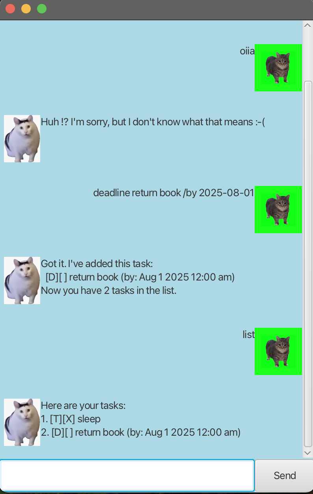

# Meow User Guide



Meow is a task management chatbot that helps you track todos, deadlines, events, and fixed-duration tasks. Use simple commands to add, list, mark, delete, or search your tasks.

## Listing tasks

Displays all tasks currently in your task list.

Example: `list`

```
1.[T][ ] Buy groceries
2.[D][X] Submit report (by: 2025-09-18 23:59)
3.[E][ ] Team meeting (from: 2025-09-17 14:00 to: 2025-09-17 16:00)
```

## Adding a Todo

Adds a simple todo task.

Example: `todo Read book`

```
Got it! I've added this task:
[T][ ] Read book
Now you have 3 tasks in the list.
```

## Adding deadlines

<!-- Describe the action and its outcome. -->
Adds a task with a specific deadline. Date format: `yyyy-MM-dd` optionally followed by `HH:mm`.

<!-- Give examples of usage -->
Example: `deadline Submit assignment /by 2025-09-18 23:59`

```
Got it! I've added this task:
[D][ ] Submit assignment (by: 2025-09-18 23:59)
Now you have 4 tasks in the list.
```

## Adding events

Adds an event with a start and end time.

Example: `event Team meeting /from 2025-09-17 14:00 /to 2025-09-17 16:00`

```
Got it! I've added this task:
[E][ ] Team meeting (from: 2025-09-17 14:00 to: 2025-09-17 16:00)
Now you have 5 tasks in the list.
```

## Adding fixed duration tasks

Adds a task that requires a fixed amount of time. Duration format: `2h`, `90m`, or `1h 30m`.

Example: `fixed Read report /needs 2h 30m`

```
Got it! I've added this task:
[F][ ] Read report (needs: 2 hours 30 minutes)
Now you have 6 tasks in the list.
```

## Marking a task as done

Marks a task as completed (by index).

Example: `mark 2`

```
Nice! I've marked this task as done:
[D][X] Submit assignment (by: 2025-09-18 23:59)
```

## Unmarking a task

Marks a previously completed task as not done (by index).

Example: `unmark 2`

```
OK, I've marked this task as not done yet:
[D][ ] Submit assignment (by: 2025-09-18 23:59)
```

## Deleting a task

Removes a task from your list (by index).

Example: `delete 3`

```
Noted. I've removed this task:
[E][ ] Team meeting (from: 2025-09-17 14:00 to: 2025-09-17 16:00)
Now you have 5 tasks in the list.
```

## Finding tasks

Searches tasks containing the given keyword.

Example: `find report`

```
Here are the matching tasks in your list:
1.[D][ ] Submit report (by: 2025-09-18 23:59)
2.[F][ ] Read report (needs: 2 hours 30 minutes)
```

## Exiting Meow

Exits the chatbot. Closes the window directly.

Example: `bye`
